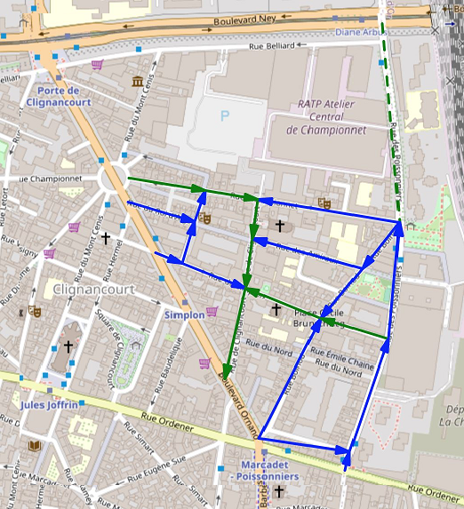

# street-plan

street-plan est une ébauche d'assistant de plan de circulation. En cliquant sur les flèches, on fait apparaitre (ou disparaitre) des rat runs. Cela marche uniquement sur desktop. L'idée est de facilement dessiner les plans de circulation, de visualiser les rat runs, et peut-être à terme de générer semi-automatiquement une partie des plans.

Voilà un exemple de plan de circu pour le quartier Boinod/Simplon dans le 18ème arrondissement de Paris :
-  Axes actuels
-  Axes modifiés
-  Rat runs

## Comment utiliser street-plan ?

Il y a deux phases :
1. **Une étape de préparation :** configuration d'un geojson pour décrire un quartier sur [cocarto.com](cocarto.com)
2. **Une étape d'analyse :** charger le geojson dans street-plan et analyser les plans de circulation possibles

## Phase de préparation : comment configurer un geojson pour son quartier ?

Le fichier geojson décrit les carrefours (noeuds) et les sens de circulation du quartier, simples ou doubles. Le geojson doit contenir un nuage de points et ceux-ci doivent être annotés via les propriétés ci-dessous. Pour le créer, on peut utiliser [cocarto.com](https://cocarto.com/) ou d'autres éditeurs de geojson.

### Etapes

1. Créer une nouvelle couche dans [cocarto.com](https://cocarto.com/)
2. Ajouter les 7 colonnes listées ci-dessous
3. Créer chacun des points ou "noeuds" (5-10 min)
4. Remplir les 7 colonnes (30-45 min)
5. Exporter le fichier geojson et l'importer dans street-plan

### Configuration : colonnes à ajouter

Type nombre entier:
- `id`

Type booléen:
- `transit_node`

Type texte:
- `local_street`
- `transit_street`
- `local_street_double_way` _(optionnel)_
- `local_street_modal_filter` _(optionnel)_
- `transit_exceptions` _(optionnel)_

*Notes :*
- les colonnes de type texte doivent toutes suivre le même format "21,25,26" c'est-à-dire une suite d'entiers séparés par des virgules.
- contrairement à la capture d'écran, tous les noms de colonnes doivent être définies en minuscule

### Annotation des colonnes

Chaque noeud est identifié au moyen d'un identifiant `id`, un nombre entier qui doit être unique (1, 2, 3, etc). L'`id` servira ensuite à définir les sens de circulation et les axes de transits.

`local_street`, `local_street_double_way` et `local_street_modal_filter` permettent de définir les sens de circulation dans les segments locaux de rue :
- `local_street` : sens de circulation unique à sens unique
- `local_street_double_way` : à double-sens
- `local_street_modal_filter` : aucun sens de circulation

`transit_node` est utilisé pour définir un noeud de transit.

`transit_street` et `transit_exceptions` permettent de raffiner les axes de transits et les transits pertinents.

### Comment définir les transits pertinents ?

Si des noeuds de transit sont des noeuds successifs d'un même boulevard, on peut considérer inutile de vouloir montrer un rat run de l'un de ces noeuds à l'autre. On peut alors relier ces noeuds entre eux par `transit_street`. Ces noeuds feront alors partie d'un même "axe de transit", et l'algorithme ne cherchera pas à relier 2 noeuds du même axe de transit.

L'algorithme cherchera par contre à relier des axes de transit différents entre eux, de tel sorte qu'il passe par des noeuds locaux.

On peut également définir des exceptions via `transit_exceptions` (non affiché sur la capture d'écran). Si 1 et 14 sont des noeuds de transit mais qu'on considère que les relier n'est pas pertinent et encombrerait la représentation du plan, on peut ajouter la valeur "14" dans `transit_exceptions` à la ligne où `id` vaut 1. L'algorithme ignorera les rat runs démarrant de 1 et aboutissant à 14.

### Erreurs au chargement

Une relation entre un noeud A et un noeud B ne peut être définie qu'une et une seule fois. Une erreur est générée :
- Si A référence B et B référence A
- Si A référence B de plusieurs manières différentes (`local_street` et `local_street_modal_filter` par exemple)

En cas d'erreur, une exception s'affiche (dans la console, F12) et le chargement est saboté.

## Phase d'analyse

En cliquant sur un segment, la _flèche_ itère entre ces états :
- sens de circulation 
- sens de circulation inverse
- sens de circulation double
- aucun sens de circulation

L'état initial défini dans le geojson est en , les autres états en . En  s'affichent les rat runs.
